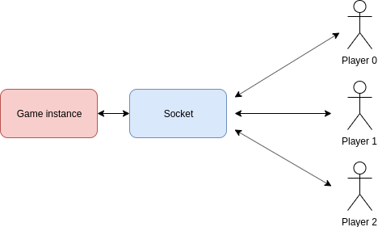

# Analyser

## 1. Analyser

Aujourd'hui, on ne peut pas jouer avec ses amis en simultané, tout en aillant une conversation. C'est le but de notre projet: Permettre a l'utilisateur de jouer avec ses amis a des quizz en ligne, tout en leur permettant de discuter. 

Le probleme principal que nous avons est de réaliser un flux de streaming permettant a la fois de discuter, et de répondre aux questions proposées par le serveur. 

On peut donc décomposer en sous projet suivant:
* Envoyer des questions a l'utilisteur
* Permettre aux utilisateurs de repondre aux questions en meme temps
* Permettre aux utilisateurs de chatter en meme temps que jouer
* Calculer le temps de réponse pour chaque question
* Avoir la possibilité de créer plusieurs rooms
* Accéder a l'historique des scores (par partie et le total de toutes les parties)

## 2. Concevoir

### Web socket

Un jeu de chat tel que DM Quizz est basé sur des flux de données en temps réel. Les web sockets répondent à ce besoin, leur but est de :

* Envoyer des messages dans le chat
* Recevoir des messages dans le chat
* Envoyer des notifications de jeu (attribution des points, annonce du vainqueur etc...)

L'utilisation de ces sockets est intimement lié au user management. Pour chaque partie, un namespace de la socket est reservé à ses joueurs. Il faut donc gérer l'inscription des joueurs de la partie au namespace.

### Récupérer des questions

Afin de proposer un quizz variée et non redondant, il est impératif de nous appuyer sur une base de données. Nous avons choisi : https://opentdb.com/. Elle permet de récupérer des questions en anglais de deux types :

* Questions à choix multiple
* Questions du type vrai / faux

### Gestion des utilisateurs

Un compte utilisateur est composé de plusieurs attributs :

* Un identifier unique (son username)
* Un mot de passe haché
* La liste des parties

Toutes ces informations sont stocké dans la base de donnée. Pour stocker les mots de passe et gérer le système d'authentification nous utiliserons bcrypt.

## 3. Planifier

Nous voulons terminer le projet avant noël. Nous avons donc réparti nortre travail en trois semaines. 

###Sprint 1

* [BACK] Authentication system 
* [BACK] Main game Loop
* [BACK] Model
* [FRONT] Model
* [FRONT] UI quizz
* [FRONT] Authentication system

###Sprint 2

* [BACK] Score system
* [BACK] Store data
* [FRONT] UI Room List
* [FRONT] UI Register / Login
* [FRONT] Score system

###Sprint 3

* [BACK] Optimisation
* [FRONT] Score tabs
* [BACK] Deployment
* [FRONT] Deployment

Fin du projet : 17 décembre 2019

## 4. Prototype

Le projet permettra a l'utilisateur de créer un compte ou de se connecter. Il aura ainsi accès a toutes ses rooms et pourra aussi en créer une. Une fois dans une room, il peut chatter avec un ou plusieurs utilisateurs et peut démarrer un quizz. 

Lors du quizz, le nombre de points attribué a chauque utilisateur se fera de la manière suivante: Une fois que tout les utilisateur ont recu la question, ils ont 20 secondes pour y repondre. Plus l'utilisateur met de temps a y rempondre, moins il gagne de points. Par exemple, l'utilisateur met 8 secondes à donner la bonne réponse `20 - 8 = 12`, il aura donc gagné 12 points a cette question. Si il ne reponds pas a la question, il se voit attribuer 0 points.

Une partie est composé de 15 questions. On donne la possibilité a l'utilisateur de voir le score final a la fin de la partie, mais aussi son historique des parties, soit par room, soit au total.
